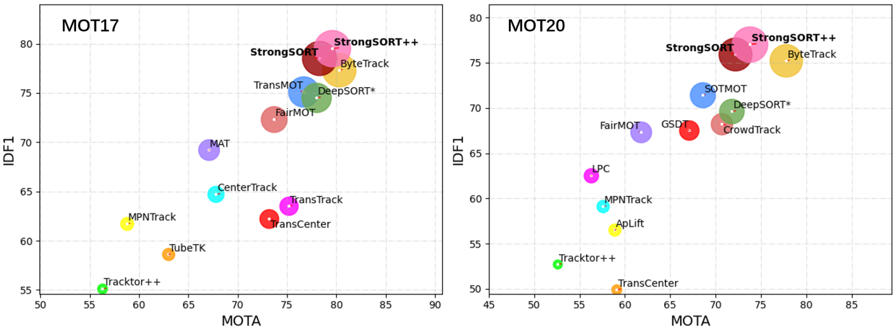
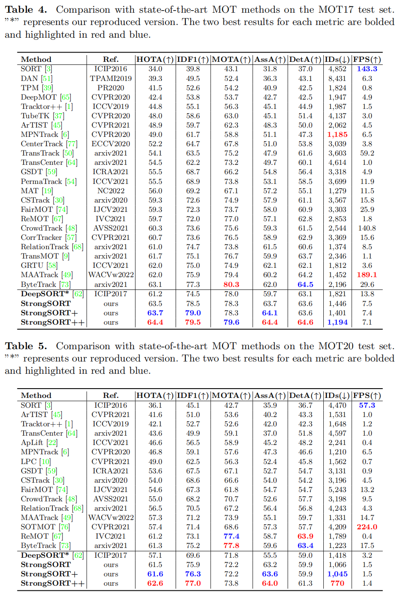

# TransLink
**TRANSLINK: TRANSFORMER-BASED EMBEDDING FOR TRACKLETS’ GLOBAL LINK**



>**[StrongSORT: Make DeepSORT Great Again](https://ieeexplore.ieee.org/document/10097136)**
>
>Yanting Zhang, Shuanghong Wang, Yuxuan Fan, Gaoang Wang, Cairong Yan

## Abstract

Multi-object tracking (MOT) is essential to many tasks related to the smart transportation. Detecting and tracking humans on the road can give a vital feedback for either the moving vehicle or traffic control to ensure better driving safety and traffic flow. However, most trackers face a common problem of identity (ID) switch, resulting in an incomplete human tra- jectory prediction. In this paper, we propose a Transformer- based tracklet linking method called TransLink to mitigate the association failures. Specifically, the self-attention mech- anism is well exploited to get the feature representation for tracklets, followed by a multilayer perceptron to predict the association likelihood, which can be further used in determin- ing the tracklet association. Experiments on the MOT dataset demonstrate the effectiveness of the proposed module in lift- ing the tracking performances.

## vs. SOTA



## Data&Model Preparation

1. Download MOT17 & MOT20 from the [official website](https://motchallenge.net/).

   ```
   path_to_dataset/MOTChallenge
   ├── MOT17
   	│   ├── test
   	│   └── train
   └── MOT20
       ├── test
       └── train
   ```

## Requirements

- Python3.6
- torch 1.7.0 + torchvision 0.8.0
- requirements.txt

## Tracking

- **Extract features**

Define `root_img`, `dir_in_det`, and `dir_out_det` to your own path, and then run:

  ```shell
  python fast-reid-master/reid.py
  ```

- **Run StrongSORT on MOT17-val**

Define ` dir_in` to your own path, then run:

  ```shell
  python AFLink/AppFreeLink.py
  ```

## Citation

```
@misc{2202.13514,
Author = {Yunhao Du and Yang Song and Bo Yang and Yanyun Zhao},
Title = {StrongSORT: Make DeepSORT Great Again},
Year = {2022},
Eprint = {arXiv:2202.13514},
}
```
You can also consider reading and citing our related work, GIAOTracker, which won the 2nd place in the VisDrone2021 MOT Challenge of ICCV Workshop:
```
@InProceedings{Du_2021_ICCV,
    author    = {Du, Yunhao and Wan, Junfeng and Zhao, Yanyun and Zhang, Binyu and Tong, Zhihang and Dong, Junhao},
    title     = {GIAOTracker: A Comprehensive Framework for MCMOT With Global Information and Optimizing Strategies in VisDrone 2021},
    booktitle = {Proceedings of the IEEE/CVF International Conference on Computer Vision (ICCV) Workshops},
    month     = {October},
    year      = {2021},
    pages     = {2809-2819}
}
```

## Acknowledgement

A large part of the codes, ideas and results are borrowed from [DeepSORT](https://github.com/nwojke/deep_sort), [JDE](https://github.com/Zhongdao/Towards-Realtime-MOT), [YOLOX](https://github.com/Megvii-BaseDetection/YOLOX) and [ByteTrack](https://github.com/ifzhang/ByteTrack). Thanks for their excellent work!

# TransLink